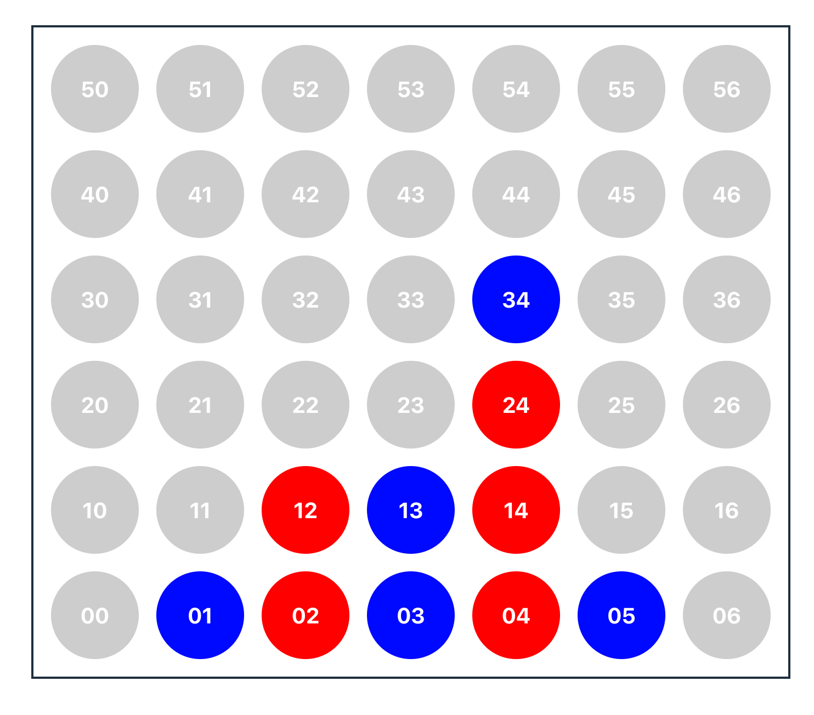

# Connect 4

This is a very basic game made using React + TypeScript + Vite

You just simply execute with: 
```
pnpm i
pnpm dev
```

open the url in a browser at http://localhost:5173/

and enjoy. 

You can click on any element of the column you want to fill with your piece during your turn




you can build for releasing with 
```sh
pnpm run build
```

install a server, like serve
```sh
pnpm install -g serve
````

and serve
```sh
serve -s dist 
```